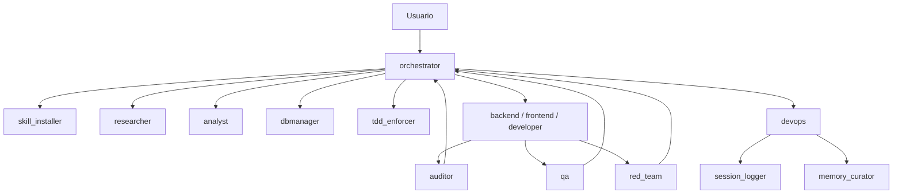

# Sistema Multi-Agente v3.1

[](SISTEMA_COMPLETO.md)
[](stack.md)
[](scripts/run-tests/run-tests.sh)
[](scripts/run-lint/run-lint.sh)
[](LICENSE)

Swarm de agentes con estado compartido, verificación por fases, trazabilidad operativa y toolkit local para validar contratos, ejecutar checks y sostener el flujo de trabajo del sistema.

## Índice

- [Qué es](#qué-es)
- [Stack](#stack)
- [Arquitectura](#arquitectura)
- [TASK_STATE](#task_state)
- [Agentes](#agentes)
- [Estructura](#estructura)
- [Manual de uso](#manual-de-uso)
- [Prompts disponibles](#prompts-disponibles)
- [Archivos ejecutables](#archivos-ejecutables)
- [Comandos útiles](#comandos-útiles)
- [Documentación](#documentación)
- [Licencia](#licencia)

## Qué es

Este repositorio contiene el núcleo operativo de un sistema multi-agente orientado a desarrollo de software. El workspace local incluye:

- contratos de agentes en `agents/*.agent.md`
- documentación operativa en `SISTEMA_COMPLETO.md`
- scripts de validación, lint y test en `scripts/`
- customizaciones de Copilot en `.github/`
- memoria compartida y audit trail del sistema
- artefactos de evaluación y verificación contractual en `agents/evals/` y `agents/eval_outputs/`

## Stack

| Capa | Tecnología | Ubicación |
|---|---|---|
| Orquestación | contratos Markdown | `agents/*.agent.md` |
| Toolkit local | Python + Bash + PowerShell | `scripts/` |
| Automatización | GitHub Actions | `.github/workflows/` |
| Estado compartido | `TASK_STATE` | flujo completo del swarm |

Notas importantes:

- El stack efectivo del workspace está curado en `stack.md`.
- Flutter/Dart solo aplica cuando la tarea apunta a un proyecto externo con `pubspec.yaml`.
- La configuración MCP del repo ya no depende de un servicio HTTP embebido local.

## Arquitectura

El sistema está coordinado por `orchestrator` y usa un flujo por fases con verificación paralela antes de cualquier despliegue.



La especificación completa del flujo, reintentos, gates y handoffs vive en `SISTEMA_COMPLETO.md`.

## TASK_STATE

Todo el swarm gira alrededor de un estado compartido mínimo:

```json
{
  "task_id": "",
  "goal": "",
  "plan": [],
  "current_step": "",
  "files": [],
  "risk_level": "LOW | MEDIUM | HIGH",
  "timeout_seconds": 0,
  "attempts": 0,
  "history": []
}
```

Extensiones compatibles del proyecto:

- `constraints`
- `risks`
- `artifacts`

Reglas clave:

- `history` siempre hace append
- `risk_level` se clasifica antes de planificar
- `timeout_seconds` define el presupuesto duro de la fase activa
- `files` define el scope operativo del ciclo
- los agentes operativos emiten `director_report` y `agent_report`

## Agentes

### Núcleo de ejecución

- `orchestrator`: clasifica, planifica y sincroniza el swarm
- `backend`, `frontend`, `developer`: implementadores según dominio
- `dbmanager`: diseño y migraciones de datos
- `tdd_enforcer`: tests en RED antes de producción

### Verificación

- `auditor`: seguridad y correctitud crítica
- `qa`: verificación funcional
- `red_team`: edge cases y vectores hostiles

### Soporte del ciclo

- `skill_installer`: detecta stack y skills activos
- `researcher`: mapea el módulo afectado
- `analyst`: análisis estratégico y features ausentes
- `devops`: único agente con permisos git
- `session_logger`: audit trail append-only
- `memory_curator`: consolidación de aprendizajes

## Estructura

```text
.
├── .github/
│   ├── copilot-instructions.md
│   ├── prompts/
│   └── workflows/
├── agents/
│   ├── *.agent.md
│   ├── eval_outputs/
│   ├── evals/
│   └── memoria_global.md
├── instructions/
├── logs/
├── runs/
├── scripts/
├── session-state/
├── session_log.md
├── SISTEMA_COMPLETO.md
├── stack.md
└── README.md
```

Rutas importantes:

- `agents/memoria_global.md`: memoria compartida persistente
- `agents/evals/`: catálogo y plantillas de evaluación
- `agents/eval_outputs/`: reportes generados por eval gate u otras corridas
- `session_log.md`: traza append-only del sistema

## Manual de uso

### 1. Preparar el entorno

Requisitos:

- Git Bash en Windows o Bash compatible en Linux/macOS
- Python disponible en PATH
- opcional: Docker para aislamiento con `sandbox-run.sh`

En Windows:

- si usas Git Bash o WSL, `./scripts/...` funciona directamente
- si usas PowerShell, usa los wrappers `./scripts/<nombre>/<nombre>.ps1`, que localizan Git Bash automáticamente y evitan el `bash.exe` de WSL

Variables de entorno frecuentes:

- `POSTGRES_DB_URL` si el proyecto activo necesita queries directas por MCP Postgres
- `GITHUB_TOKEN` para integraciones remotas con GitHub
- `OPENAI_API_KEY` si alguna tarea o skill externa la requiere

Bootstrap recomendado:

- Instalar prompts y toolkit globales en tu perfil de VS Code: `./scripts/install-copilot-layout/install-copilot-layout.ps1 --force` o `bash ./scripts/install-copilot-layout/install-copilot-layout.sh --force`
- Recargar VS Code
- Usar `/start` desde el chat en cualquier workspace para bootstrap del repo actual

Bootstrap manual del repo actual:

- PowerShell: `./scripts/start/start.ps1 .`
- Bash: `bash ./scripts/start/start.sh .`

`install-copilot-layout` instala prompts globales en la carpeta de usuario de VS Code y deja un toolkit en el perfil del usuario. Después, `/start` usa ese toolkit para hacer un bootstrap mínimo del repo actual: copiar `.github/copilot-instructions.md` si falta, crear `stack.md` si falta e intentar descargar skills con `autoskills` si está disponible. `/start` no materializa `.github/prompts`, `.github/workflows`, `scripts/` ni archivos `.env*` dentro del repo destino.

### 2. Validar el workspace

También puedes invocarlo desde el chat con `/validar` en este repositorio.

```bash
bash ./scripts/validate-stack/validate-stack.sh .
bash ./scripts/validate-agents/validate-agents.sh
bash ./scripts/validate-memory/validate-memory.sh
```

En PowerShell:

```powershell
./scripts/validate-stack/validate-stack.ps1 .
./scripts/validate-agents/validate-agents.ps1
./scripts/validate-memory/validate-memory.ps1
```

`validate-stack.sh` resuelve automáticamente el subproyecto real cuando la raíz del repo no contiene los manifests directos.

### 3. Ejecutar tests y lint

También puedes invocarlos desde el chat con `/tests` y `/lint` en este repositorio.

En esta raíz toolkit, `run-tests` detecta el stack `toolkit` y ejecuta `run_eval_gate.py` sin persistir reporte; `run-lint` detecta `toolkit` y ejecuta `validate-agents` seguido de `token-report`. Si apuntas a un subproyecto con manifest, ambos mantienen el autodetect tradicional por stack.

```bash
bash ./scripts/run-tests/run-tests.sh . --json
bash ./scripts/run-lint/run-lint.sh . --json
```

En PowerShell:

```powershell
./scripts/run-tests/run-tests.ps1 . --json
./scripts/run-lint/run-lint.ps1 . --json
```

Si quieres aislar la ejecución, usa `sandbox-run`:

```bash
bash ./scripts/sandbox-run/sandbox-run.sh . tests --json
bash ./scripts/sandbox-run/sandbox-run.sh . lint --json
```

En PowerShell:

```powershell
./scripts/sandbox-run/sandbox-run.ps1 . tests --json
./scripts/sandbox-run/sandbox-run.ps1 . lint --json
```

`sandbox-run.sh` usa Docker si está disponible y, si no, cae a ejecución directa en host.

### 4. Ejecutar eval gate

También puedes invocarlo desde el chat con `/eval-gate`.

```bash
python ./scripts/run_eval_gate.py --root .
```

Este script ejecuta comprobaciones automáticas sobre contratos de agentes y genera un reporte markdown consumible por CI o por revisión manual.

### 5. Flujo de trabajo recomendado

1. validar stack y contratos
2. revisar memoria compartida y documentación
3. ejecutar la tarea a través de `orchestrator`
4. verificar tests/lint desde raíz o con sandbox
5. correr `run_eval_gate.py` si tocaste contratos de agentes
6. revisar `session_log.md` y memoria al cierre del ciclo

## Prompts disponibles

Los slash commands disponibles en este workspace son estos:

- `/start`: bootstrap mínimo del repo actual, crea `copilot-instructions`, detecta el stack e intenta descargar skills.
- `/validar`: ejecuta `validate-stack`, `validate-agents` y `validate-memory`.
- `/tests`: ejecuta el runner de tests del workspace.
- `/lint`: ejecuta el runner de lint del workspace.
- `/sandbox-tests`: ejecuta los tests en sandbox Docker o en host si Docker no está disponible.
- `/sandbox-lint`: ejecuta el lint en sandbox Docker o en host si Docker no está disponible.
- `/eval-gate`: corre el gate automático de contratos de agentes.

Estos prompts viven en `.github/prompts/` y también pueden instalarse como prompts globales con `install-copilot-layout`.

## Archivos ejecutables

Los entrypoints operativos reales del repositorio son estos.

Nota para Windows PowerShell: cada script `.sh` listado abajo tiene un wrapper `.ps1` equivalente en la misma subcarpeta.

| Archivo | Qué hace | Uso principal |
|---|---|---|
| `scripts/install-copilot-layout/install-copilot-layout.sh` | Instala prompts globales y un toolkit portable en el perfil de usuario de VS Code para que los slash commands funcionen en cualquier workspace. | `bash ./scripts/install-copilot-layout/install-copilot-layout.sh --force` |
| `scripts/install-repo-layout/install-repo-layout.sh` | Instala el layout canónico completo del repo actual en `.github/` y copia los scripts de soporte necesarios. Úsalo solo si quieres materializar el toolkit dentro del repositorio. | `bash ./scripts/install-repo-layout/install-repo-layout.sh .` |
| `scripts/start/start.sh` | Bootstrap mínimo del proyecto: copia `.github/copilot-instructions.md` si falta, crea `stack.md` si falta e intenta descargar skills con `autoskills` sin bloquear si falla. No copia prompts, workflows, scripts ni `.env*`. | `bash ./scripts/start/start.sh .` |
| `scripts/validate-stack/validate-stack.sh` | Detecta el stack activo, resuelve el subproyecto real y genera/actualiza `stack.md` en raíz. Si existe el layout legado, también lo reutiliza. | `bash ./scripts/validate-stack/validate-stack.sh .` |
| `scripts/validate-agents/validate-agents.sh` | Valida que cada `*.agent.md` tenga frontmatter, `director_report`, `AUTONOMOUS_LEARNINGS` y `timeout_seconds` cuando declara `TASK_STATE`. | `bash ./scripts/validate-agents/validate-agents.sh` |
| `scripts/validate-memory/validate-memory.sh` | Verifica `agents/memoria_global.md`, el tamaño de `AUTONOMOUS_LEARNINGS` por agente y el estado de `session_log.md`. | `bash ./scripts/validate-memory/validate-memory.sh` |
| `scripts/run-tests/run-tests.sh` | Detecta el stack y ejecuta los tests del proyecto; en esta raíz toolkit mapea `tests` a `run_eval_gate.py` sin escribir reporte persistente. | `bash ./scripts/run-tests/run-tests.sh . --json` |
| `scripts/run-lint/run-lint.sh` | Detecta el stack y ejecuta el linter adecuado; en esta raíz toolkit mapea `lint` a `validate-agents` + `token-report`. | `bash ./scripts/run-lint/run-lint.sh . --json` |
| `scripts/sandbox-run/sandbox-run.sh` | Ejecuta `tests` o `lint` dentro de un contenedor Docker aislado; si Docker no está disponible, usa el host. | `bash ./scripts/sandbox-run/sandbox-run.sh . tests --json` |
| `scripts/token-report/token-report.sh` | Estima tokens por contrato `.agent.md`, detecta agentes sobredimensionados y calcula el total de una sesión completa. | `bash ./scripts/token-report/token-report.sh` |
| `scripts/run_eval_gate.py` | Ejecuta checks automáticos sobre contratos de agentes y genera un reporte markdown consumible por CI. | `python ./scripts/run_eval_gate.py --root . --report-file agents/eval_outputs/ci_eval_gate_report.md` |
| `scripts/verified_digest.py` | Calcula `verified_digest` para un conjunto de archivos y valida consenso entre reports de Fase 3. | `python ./scripts/verified_digest.py compute --workspace-root . agents/orchestrator.agent.md` |

Atajos útiles por archivo:

- `validate-memory.sh`: acepta `bash ./scripts/validate-memory/validate-memory.sh [AGENTS_DIR] [SESSION_LOG]` o `./scripts/validate-memory/validate-memory.ps1 [AGENTS_DIR] [SESSION_LOG]`
- `run-tests.sh`: acepta `bash ./scripts/run-tests/run-tests.sh [PROJECT_ROOT] [--json]` o `./scripts/run-tests/run-tests.ps1 [PROJECT_ROOT] [--json]`
- `run-lint.sh`: acepta `bash ./scripts/run-lint/run-lint.sh [PROJECT_ROOT] [--json]` o `./scripts/run-lint/run-lint.ps1 [PROJECT_ROOT] [--json]`
- `sandbox-run.sh`: acepta `bash ./scripts/sandbox-run/sandbox-run.sh <project_root> <tests|lint> [--json]` o `./scripts/sandbox-run/sandbox-run.ps1 <project_root> <tests|lint> [--json]`
- `verified_digest.py`: soporta `compute` y `verify-consensus`

Ejemplos rápidos:

```bash
# Ver contratos y memoria
bash ./scripts/validate-agents/validate-agents.sh
bash ./scripts/validate-memory/validate-memory.sh

# Tests y lint directos
bash ./scripts/run-tests/run-tests.sh . --json
bash ./scripts/run-lint/run-lint.sh . --json

# Tests aislados con Docker si está disponible
bash ./scripts/sandbox-run/sandbox-run.sh . tests --json

# Digest de archivos críticos
python ./scripts/verified_digest.py compute --workspace-root . agents/orchestrator.agent.md agents/devops.agent.md
```

Archivo de soporte relacionado:

- `scripts/Dockerfile.sandbox`: imagen base usada por `sandbox-run.sh` para ejecutar `tests` y `lint` en aislamiento.

## Comandos útiles

| Objetivo | Comando |
|---|---|
| Bootstrap del proyecto por chat | `/start` |
| Instalar prompts y toolkit globales | `./scripts/install-copilot-layout/install-copilot-layout.ps1 --force` en PowerShell, `bash ./scripts/install-copilot-layout/install-copilot-layout.sh --force` en Bash |
| Bootstrap del proyecto | `/start` o `./scripts/start/start.ps1 .` en PowerShell, `bash ./scripts/start/start.sh .` en Bash |
| Instalar layout canónico completo en el repo actual | `./scripts/install-repo-layout/install-repo-layout.ps1 .` en PowerShell, `bash ./scripts/install-repo-layout/install-repo-layout.sh .` en Bash |
| Detectar stack | `./scripts/validate-stack/validate-stack.ps1 .` en PowerShell, `bash ./scripts/validate-stack/validate-stack.sh .` en Bash |
| Validar contratos | `./scripts/validate-agents/validate-agents.ps1` en PowerShell, `bash ./scripts/validate-agents/validate-agents.sh` en Bash |
| Validar memoria | `./scripts/validate-memory/validate-memory.ps1` en PowerShell, `bash ./scripts/validate-memory/validate-memory.sh` en Bash |
| Ejecutar validación completa por chat | `/validar` |
| Ejecutar tests por chat | `/tests` |
| Ejecutar lint por chat | `/lint` |
| Ejecutar tests | `./scripts/run-tests/run-tests.ps1 . --json` en PowerShell, `bash ./scripts/run-tests/run-tests.sh . --json` en Bash |
| Ejecutar lint | `./scripts/run-lint/run-lint.ps1 . --json` en PowerShell, `bash ./scripts/run-lint/run-lint.sh . --json` en Bash |
| Ejecutar tests en sandbox por chat | `/sandbox-tests` |
| Ejecutar lint en sandbox por chat | `/sandbox-lint` |
| Ejecutar tests/lint aislados | `./scripts/sandbox-run/sandbox-run.ps1 . tests --json` en PowerShell, `bash ./scripts/sandbox-run/sandbox-run.sh . tests --json` en Bash |
| Ejecutar eval gate por chat | `/eval-gate` |
| Correr gate contractual | `python ./scripts/run_eval_gate.py --root .` |
| Calcular digest verificado | `python ./scripts/verified_digest.py compute --workspace-root . agents/orchestrator.agent.md` |

## Documentación

- `SISTEMA_COMPLETO.md`: contratos, fases, reglas de verificación y evolución del sistema
- `.github/copilot-instructions.md`: convenciones del repo cargadas por Copilot
- `.github/prompts/`: slash commands del workspace (`/start`, `/validar`, `/tests`, etc.)
- `.github/workflows/`: workflows canónicos de GitHub Actions (`ci.yml` y `rollback.yml`)
- `stack.md`: stack efectivo del workspace
- `agents/memoria_global.md`: memoria compartida del sistema

## Licencia

Este repositorio se distribuye bajo una licencia de uso interno y evaluación. Consulta el archivo `LICENSE` para condiciones completas de uso, redistribución y autorización.

## Estado actual

El workspace está preparado para:

- validar contratos de agentes
- ejecutar tests y lint desde la raíz
- operar con `TASK_STATE` compartido y salida dual por agente
- documentar decisiones y trazabilidad del swarm de forma consistente
- generar reportes de eval gate para control contractual