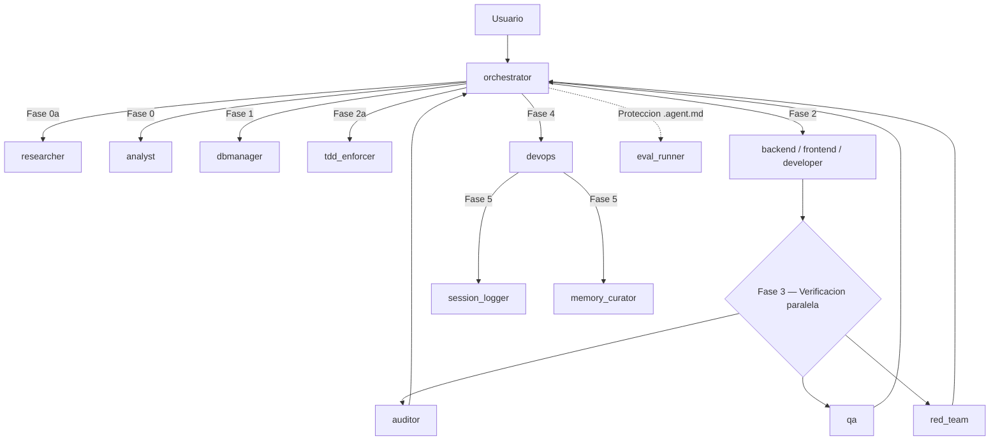

# Sistema Multi-Agente v3.1

[](SISTEMA_COMPLETO.md)
[](stack.md)
[](LICENSE)

Swarm de agentes con estado compartido, verificación por fases, trazabilidad operativa y toolkit local para bootstrap, instalación de layout y soporte del flujo de trabajo.

Incluye planner e instaladores multi-cliente para Claude, Codex, Copilot, Cursor, Antigravity y Windsurf, expuestos como paquetes npm/pnpm sin dependencias externas.

Requisitos para usar paquetes publicados:

- Node.js 20+
- `pnpm` via `corepack pnpm` si Corepack está disponible; si no, usa `npm exec`

## Índice

- [Qué es](#qué-es)
- [Stack](#stack)
- [Arquitectura](#arquitectura)
- [TASK_STATE](#task_state)
- [Agentes](#agentes)
- [Estructura](#estructura)
- [Manual de uso](#manual-de-uso)
- [Instalación Multi-Cliente](#instalación-multi-cliente)
- [Prompts disponibles](#prompts-disponibles)
- [Archivos ejecutables](#archivos-ejecutables)
- [Comandos útiles](#comandos-útiles)
- [Documentación](#documentación)
- [Licencia](#licencia)

## Qué es

Este repositorio contiene el núcleo operativo de un sistema multi-agente orientado a desarrollo de software. El workspace local incluye:

- contratos de agentes en `agents/*.agent.md`
- documentación operativa en `SISTEMA_COMPLETO.md`
- scripts de bootstrap, instalación y soporte en `scripts/`
- customizaciones de Copilot en `.github/`
- memoria compartida y audit trail del sistema
- artefactos de evaluación y verificación contractual en `agents/evals/` y `agents/eval_outputs/`

## Stack

| Capa | Tecnología | Ubicación |
|---|---|---|
| Orquestación | contratos Markdown | `agents/*.agent.md` |
| Toolkit local | Python + Bash + PowerShell | `scripts/` |
| Automatización | GitHub Actions | `.github/workflows/` |
| Estado compartido | `TASK_STATE` | flujo completo del swarm |

Notas importantes:

- El stack efectivo del workspace está curado en `stack.md`.
- Flutter/Dart solo aplica cuando la tarea apunta a un proyecto externo con `pubspec.yaml`.
- La configuración MCP del repo no depende de un servicio HTTP embebido local.

## Arquitectura

El sistema está coordinado por `orchestrator` y usa un flujo por fases con verificación paralela antes de cualquier despliegue.



La especificación completa del flujo, reintentos, gates y handoffs vive en `SISTEMA_COMPLETO.md`.

## Zero-human-loop

El sistema está disenado para que **un solo prompt del usuario produzca un PR mergeado** (o un `ESCALATE` motivado), sin confirmaciones intermedias.

- `orchestrator` **nunca** pregunta aclaraciones; ante ambiguedad materializa la asuncion mas razonable y la registra en `task_state.assumptions`.
- Todas las verificaciones de Fase 3 (digest, bundle correlation, branch state, index binding, tools) viven en `scripts/gate/` y son **deterministicas** — no LLM-as-judge.
- `devops` invoca `python scripts/gate/gate.py --bundle <bundle.json> --rebuild-index` como primera accion. Si exit != 0 → `REJECTED` con causa concreta.
- Tras commit + push, `devops` crea PR via MCP GitHub y hace **auto-merge** salvo cuando `verified_files` toca `agents/*.agent.md`, `scripts/gate/`, `.mcp.json` o `.github/workflows/` (en cuyo caso queda con label `agent-change-requires-human`).
- Polling CI post-merge: si falla, `devops` ejecuta `git revert` + `ESCALATE`.
- `escalate_to: human` solo se permite en 4 casos: `retry_count >= 2` con causa raiz no resoluble, `cycle_budget_seconds` agotado, gate detecta tampering irreparable, o accion irreversible sobre datos productivos sin DRY-RUN.

### Plano deterministico

```
findings JSON  ->  bundle.json  ->  scripts/gate/gate.py  ->  commit  ->  PR  ->  auto-merge  ->  CI poll
                                          |
                          bundle_gate -> digest_gate -> branch_gate -> index_gate -> tool_gate
```

Smoke E2E: `python scripts/smoke/full_cycle.py` (parte del CI en job `smoke-deterministic-plane`).

## TASK_STATE

Todo el swarm gira alrededor de un estado compartido mínimo:

```json
{
  "task_id": "",
  "goal": "",
  "plan": [],
  "current_step": "",
  "files": [],
  "risk_level": "LOW | MEDIUM | HIGH",
  "timeout_seconds": 0,
  "attempts": 0,
  "history": []
}
```

Extensiones compatibles del proyecto:

- `constraints`
- `risks`
- `artifacts`

Reglas clave:

- `history` siempre hace append
- `risk_level` se clasifica antes de planificar
- `timeout_seconds` define el presupuesto duro de la fase activa
- `files` define el scope operativo del ciclo
- los agentes operativos emiten `director_report` y `agent_report`

## Agentes

### Núcleo de ejecución

- `orchestrator`: clasifica, planifica y sincroniza el swarm
- `backend`, `frontend`, `developer`: implementadores según dominio
- `dbmanager`: diseño y migraciones de datos
- `tdd_enforcer`: tests en RED antes de producción

### Verificación

- `auditor`: seguridad y correctitud crítica
- `qa`: verificación funcional
- `red_team`: edge cases y vectores hostiles

### Soporte del ciclo

- `skill_installer`: detecta stack y skills activos
- `researcher`: mapea el módulo afectado
- `analyst`: análisis estratégico y features ausentes
- `devops`: único agente con permisos git
- `session_logger`: audit trail append-only
- `memory_curator`: consolidación de aprendizajes

## Estructura

```text
.
├── .github/
│   ├── copilot-instructions.md
│   ├── prompts/
│   └── workflows/
├── agents/
│   ├── *.agent.md
│   ├── eval_outputs/
│   ├── evals/
│   └── memoria_global.md
├── instructions/
├── logs/
├── runs/
├── scripts/
├── session-state/
├── session_log.md
├── SISTEMA_COMPLETO.md
├── stack.md
└── README.md
```

Rutas importantes:

- `agents/memoria_global.md`: memoria compartida persistente
- `agents/evals/`: catálogo y plantillas de evaluación
- `agents/eval_outputs/`: reportes históricos o generados por corridas de evaluación
- `session_log.md`: traza append-only del sistema

## Manual de uso

### 1. Preparar el entorno

Requisitos:

- Git Bash en Windows o Bash compatible en Linux/macOS
- Python disponible en PATH
- opcional: Docker si vas a trabajar con `docker-launcher/`

En Windows:

- si usas Git Bash o WSL, `./scripts/...` funciona directamente
- si usas PowerShell, usa los wrappers `./scripts/<nombre>/<nombre>.ps1`, que localizan Git Bash automáticamente y evitan el `bash.exe` de WSL

Variables de entorno frecuentes:

- `POSTGRES_DB_URL` si el proyecto activo necesita queries directas por MCP Postgres
- `GITHUB_TOKEN` para integraciones remotas con GitHub
- `OPENAI_API_KEY` si alguna tarea o skill externa la requiere

Bootstrap recomendado:

- Instalar prompts y toolkit globales en tu perfil de VS Code: `./scripts/install-copilot-layout/install-copilot-layout.ps1 --force` o `bash ./scripts/install-copilot-layout/install-copilot-layout.sh --force`
- Recargar VS Code
- Usar `/start` desde el chat en cualquier workspace para bootstrap del repo actual

Bootstrap manual del repo actual:

- PowerShell: `./scripts/start/start.ps1 .`
- Bash: `bash ./scripts/start/start.sh .`

`install-copilot-layout` instala prompts globales en la carpeta de usuario de VS Code y deja un toolkit en el perfil del usuario. Después, `/start` usa ese toolkit para hacer un bootstrap mínimo del repo actual: copiar `.github/copilot-instructions.md` si falta, crear `stack.md` si falta e intentar descargar skills con `autoskills` si está disponible. `/start` no materializa `.github/prompts`, `.github/workflows`, `scripts/` ni archivos `.env*` dentro del repo destino.

## Instalación Multi-Cliente

El planner central vive en `packages/core/src/install-planner.js` y el CLI en `packages/cli/`. Los wrappers legacy de `scripts/` se mantienen para Copilot, pero la superficie nueva recomendada para automatización es npm/pnpm.

Clientes soportados:

- `claude`
- `codex`
- `copilot`
- `cursor`
- `antigravity`
- `windsurf`

Comandos base:

```bash
# listar clientes
pnpm exec repo-layout-install clients

# ver plan completo para un cliente
pnpm exec repo-layout-install plan --client copilot --json

# wrapper dedicado por cliente
pnpm exec install-cursor-layout --mode repo --json
```

Uso real fuera del monorepo:

```bash
# CLI publicado con pnpm
corepack pnpm dlx @rbx/repo-layout-cli plan --client copilot --mode repo --json

# CLI publicado con npm
npm exec @rbx/repo-layout-cli@latest -- plan --client copilot --mode repo --json

# Wrapper publicado con pnpm
corepack pnpm dlx @rbx/install-copilot-layout --mode repo --json

# Wrapper publicado con npm
npm exec @rbx/install-copilot-layout@latest -- --mode repo --json
```

Smoke de empaquetado antes de publicar:

```bash
npm pack --dry-run ./packages/cli
npm pack --dry-run ./packages/clients/install-copilot
```

Notas operativas:

- `copilot` conserva wrappers legacy en `scripts/install-copilot-layout/**`, `scripts/install-repo-layout/**` y `scripts/start/**`.
- `antigravity` queda soportado mediante rutas configurables por `ANTIGRAVITY_CONFIG_DIR` y `ANTIGRAVITY_REPO_DIR`; no se asumen rutas falsas.
- Política de cleanup centralizada: `repo-layout-install cleanup-policy --json`.
- `config.json` no es cache descartable: `skill_installer` y prompts lo usan para `skills_dir` y settings locales.
- `--mode` acepta solo `global`, `repo` o `both`; cualquier otro valor falla con exit non-zero.

### 2. Dockerizar un proyecto activo

Puedes invocarlo desde el chat con `/dockerize` o trabajar directamente con la carpeta `scripts/docker-launcher/` cuando el repo ya tenga artefactos Docker.

Flujo recomendado:

1. Asegura que `stack.md` exista con `/start` o `scripts/start/start.*`.
2. Revisa `.env.example` y las variables del proyecto activo.
3. Ejecuta `/dockerize` para generar Dockerfile, compose, `.dockerignore` y `docker-launcher/` adaptados al stack.

### 3. Flujo de trabajo recomendado

1. revisar memoria compartida y documentación
2. bootstrap del repo con `/start` si `stack.md` no existe
3. ejecutar la tarea a través de `orchestrator`
4. verificar el cambio con las herramientas nativas del proyecto activo
5. revisar `session_log.md`, `verified_digest` y memoria al cierre del ciclo cuando corresponda

## Prompts disponibles

Los slash commands mantenidos en este workspace son estos:

- `/start`: bootstrap mínimo del repo actual; crea `.github/copilot-instructions.md` y `stack.md` si faltan e intenta descargar skills.
- `/dockerize`: dockeriza el proyecto activo y genera artefactos de setup local y despliegue.
- `/productionize`: decide qué parte del repo debe ir a producción, reutiliza la lógica de `/dockerize`, limpia artefactos obsoletos con criterio y deja `README.md` listo para GitHub.
- `/skill-installer`: detecta stack y skills útiles para el proyecto activo.
- `/create-project`: inicia un nuevo proyecto desde cero; captura la idea, analiza el stack y genera un brief completo con roadmap.

Estos prompts viven en `.github/prompts/` y también pueden instalarse como prompts globales con `install-copilot-layout`.

## Archivos ejecutables

Los entrypoints operativos reales del repositorio son estos.

Nota para Windows PowerShell: cada script `.sh` listado abajo tiene un wrapper `.ps1` equivalente en la misma subcarpeta cuando aplica.

| Archivo | Qué hace | Uso principal |
|---|---|---|
| `scripts/install-copilot-layout/install-copilot-layout.sh` | Instala los prompts globales preservados y un toolkit portable en el perfil de usuario de VS Code. | `bash ./scripts/install-copilot-layout/install-copilot-layout.sh --force` |
| `scripts/install-repo-layout/install-repo-layout.sh` | Instala el layout canónico completo del repo actual en `.github/` y copia los scripts de soporte todavía vigentes. | `bash ./scripts/install-repo-layout/install-repo-layout.sh .` |
| `scripts/start/start.sh` | Bootstrap mínimo del proyecto: copia `.github/copilot-instructions.md` si falta, crea `stack.md` si falta e intenta descargar skills con `autoskills` sin bloquear si falla. | `bash ./scripts/start/start.sh .` |
| `scripts/docker-launcher/setup.sh` | Prepara el entorno local para el flujo Docker generado por `/dockerize`. | `bash ./scripts/docker-launcher/setup.sh` |
| `scripts/docker-launcher/build.sh` | Construye las imágenes y artefactos del proyecto dockerizado. | `bash ./scripts/docker-launcher/build.sh` |
| `scripts/docker-launcher/launch.sh` | Levanta el stack Docker del proyecto activo con la configuración generada. | `bash ./scripts/docker-launcher/launch.sh` |
| `scripts/verified_digest.py` | Calcula `verified_digest` para un conjunto de archivos y valida consenso entre reports de Fase 3. | `python ./scripts/verified_digest.py compute --workspace-root . agents/orchestrator.agent.md` |

Atajos útiles por archivo:

- `start.sh`: acepta `bash ./scripts/start/start.sh [PROJECT_ROOT]` o `./scripts/start/start.ps1 [PROJECT_ROOT]`
- `verified_digest.py`: soporta `compute` y `verify-consensus`

Ejemplos rápidos:

```bash
# Bootstrap del repo actual
bash ./scripts/start/start.sh .

# Instalar prompts y toolkit globales
bash ./scripts/install-copilot-layout/install-copilot-layout.sh --force

# Digest de archivos críticos
python ./scripts/verified_digest.py compute --workspace-root . agents/orchestrator.agent.md agents/devops.agent.md
```

## Comandos útiles

| Objetivo | Comando |
|---|---|
| Listar clientes soportados | `pnpm exec repo-layout-install clients` |
| Ver plan multi-cliente | `pnpm exec repo-layout-install plan --client <cliente> --json` |
| Wrapper npm/pnpm de cliente | `pnpm exec install-<cliente>-layout --mode repo --json` |
| Bootstrap del proyecto por chat | `/start` |
| Dockerizar el proyecto por chat | `/dockerize` |
| Detectar skills por chat | `/skill-installer` |
| Instalar prompts y toolkit globales | `./scripts/install-copilot-layout/install-copilot-layout.ps1 --force` en PowerShell, `bash ./scripts/install-copilot-layout/install-copilot-layout.sh --force` en Bash |
| Bootstrap del proyecto | `/start` o `./scripts/start/start.ps1 .` en PowerShell, `bash ./scripts/start/start.sh .` en Bash |
| Instalar layout canónico completo en el repo actual | `./scripts/install-repo-layout/install-repo-layout.ps1 .` en PowerShell, `bash ./scripts/install-repo-layout/install-repo-layout.sh .` en Bash |
| Preparar launcher Docker | `./scripts/docker-launcher/setup.ps1` en PowerShell, `bash ./scripts/docker-launcher/setup.sh` en Bash |
| Construir imágenes Docker | `./scripts/docker-launcher/build.ps1` en PowerShell, `bash ./scripts/docker-launcher/build.sh` en Bash |
| Lanzar stack Docker | `./scripts/docker-launcher/launch.ps1` en PowerShell, `bash ./scripts/docker-launcher/launch.sh` en Bash |
| Calcular digest verificado | `python ./scripts/verified_digest.py compute --workspace-root . agents/orchestrator.agent.md` |

## Documentación

- `SISTEMA_COMPLETO.md`: contratos, fases, reglas de verificación y evolución del sistema
- `.github/copilot-instructions.md`: convenciones del repo cargadas por Copilot
- `.github/prompts/`: slash commands del workspace (`/start`, `/dockerize`, `/skill-installer`, `/create-project`)
- `.github/workflows/`: workflows canónicos de GitHub Actions (`ci.yml` y `rollback.yml`)
- `stack.md`: stack efectivo del workspace
- `agents/memoria_global.md`: memoria compartida del sistema

## Licencia

Este repositorio se distribuye bajo una licencia de uso interno y evaluación. Consulta el archivo `LICENSE` para condiciones completas de uso, redistribución y autorización.

## Estado actual

El workspace está preparado para:

- planificar instalación multi-cliente desde `packages/core` y `packages/cli`
- exponer wrappers npm/pnpm por cliente (`packages/clients/*`)
- bootstrap mínimo de repositorios con `/start`
- operar con `TASK_STATE` compartido y salida dual por agente
- materializar layout canónico con `install-repo-layout`
- generar entornos Docker con `/dockerize` y `docker-launcher/`
- documentar decisiones y trazabilidad del swarm de forma consistente

## Walkthrough

### v3.2.0 — Optimización de velocidad de la orquesta

- **P1 — Fast-path MODO RÁPIDO** (`orchestrator.agent.md`): nueva regla 1b que elimina lectura de memoria, learnings y cache para tareas clasificadas como RÁPIDO. Límite de planificación: 15s.
- **P2 — Clasificación agresiva** (`lib/task_classification.md`): señales adicionales para que más tareas califiquen como RÁPIDO (cambios en un solo módulo, widgets inline, bugfixes localizados).
- **P3 — Pre-validación implementadores** (`developer.agent.md`, `backend.agent.md`, `frontend.agent.md`): checklist obligatorio antes de entregar que elimina el ciclo auditor→implementador→auditor.
- **P4 — Contexto completo devops** (`orchestrator.agent.md`): el orchestrator incluye `test_status`, `known_failures`, `orchestrator_authorization` y `commit_message` desde la primera invocación de devops.

### v3.3.0 — Observabilidad, Resiliencia y Evals

- **Observabilidad Exportable**: `session_logger` ahora emite en dual (MD legacy y `session_spans.jsonl` con estructura de trazas OpenTelemetry-like). Se añadió el bridge script `scripts/spans-to-observer.mjs` para ingestar la data en SQLite.
- **Circuit Breakers para MCPs**: Se incorporó un marco de recuperación (`mcp_circuit_breaker.md`) con fallbacks nativos. `devops` usará su API git local y el CLI `gh` ante caídas de GitHub MCP sin bloquear el ciclo ni emitir REJECTED.
- **Memoria con TTL (Auto-decay)**: Se rediseñó la relevancia temporal en `memory_curator` (`<!-- meta: last_activated=... | activations=... | relevance=... -->`). Las entradas ahora priorizan según frescura y utilidad real y se auto-archivan hacia `memoria_global_archive.md` pasado un tiempo inerte (STALE).
- **Evals Automáticas en CI**: Validaciones estructurales y de integridad pasaron a `scripts/eval_runner_ci.py`. El CI en `.github/workflows/ci.yml` asegura un parser robusto en cada cambio sobre agentes que no rompa las expectativas del catalog.